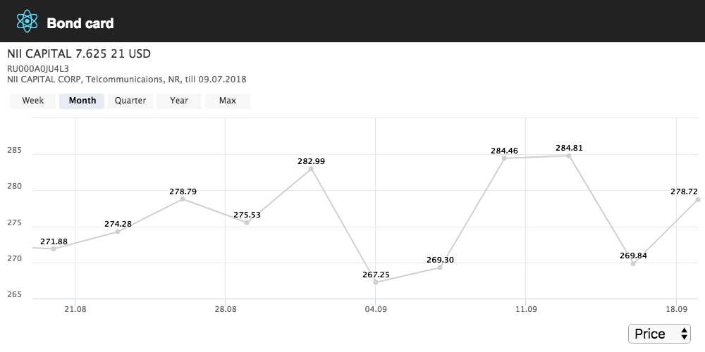

# band-card

Визуализация карточки облигации. Пример использования технологий и их тестирования. Проект содержит как unit так и e2e тесты.



## Запуск и тестирование

```sh
npm install
npm start # приложение должно запускаться на 3000 порту
npm test # запуск unit + e2e тестов
```

> 1. В связи с тем что [create-react-app](https://github.com/facebook/create-react-app) содержит [ошибку](https://github.com/facebook/create-react-app/issues/4606) из за которой нельзя запускать тесты отдельно, e2e тесты запускаются вместе с `unit` тестами.
> 1. Не удалось подключить [jest-puppeteer](https://github.com/smooth-code/jest-puppeteer) так как [create-react-app](https://github.com/facebook/create-react-app) не поддерживает `jest` preset'ы.

## Описание

В проекте, кроме `react` и `redux` использованы следующие основные зависимости:

1. [highcharts](https://github.com/highcharts/highcharts) - график
1. [redux-saga](https://github.com/redux-saga/redux-saga) - асинхронная событийная модель

Для тестирования применяются:

1. [enzyme](https://github.com/airbnb/enzyme) - эмуляция работы с `DOM`
1. [puppeteer](https://github.com/GoogleChrome/puppeteer) - эмуляция действий клиента в браузере
1. [redux-mock-store](https://github.com/dmitry-zaets/redux-mock-store) - эмуляция работы с `store`
1. [redux-saga-test-plan](https://github.com/jfairbank/redux-saga-test-plan) - тестовый фреймворк для [redux-saga](https://github.com/redux-saga/redux-saga)
1. [sinon](https://github.com/sinonjs/sinon) - моки

## Заключение

  1. В LTS проекте необходимо использовать статическую типизацию(`typescript`). Пример [react-frontend-skeleton](https://github.com/vahpetr/react-frontend-skeleton).
  1. На выполнение задачи потребовалось 8 часов.

## Приложение

### Coverage

File                          |  % Stmts | % Branch |  % Funcs |  % Lines | Uncovered Line #s |
------------------------------|----------|----------|----------|----------|-------------------|
All files                     |    50.68 |    18.42 |    49.06 |    60.17 |                   |
 src                          |    45.45 |    20.59 |    40.63 |    58.54 |                   |
  actions.js                  |      100 |      100 |      100 |      100 |                   |
  api.js                      |    85.19 |       50 |       80 |     91.3 |             30,34 |
  index.js                    |        0 |        0 |        0 |        0 |... 14,15,16,21,28 |
  reducers.js                 |      100 |      100 |      100 |      100 |                   |
  registerServiceWorker.js    |        0 |        0 |        0 |        0 |... 36,137,138,139 |
  sagas.js                    |       80 |      100 |       50 |       80 |                21 |
  types.js                    |      100 |      100 |      100 |      100 |                   |
 src/components               |    57.14 |        0 |    56.25 |    55.56 |                   |
  BondHighstockComponent.js   |    47.83 |        0 |    41.67 |    45.45 |... 6,47,51,52,141 |
  ValueTypeSelectComponent.js |      100 |      100 |      100 |      100 |                   |
 src/modules                  |       90 |      100 |       80 |    88.89 |                   |
  CardModule.js               |       90 |      100 |       80 |    88.89 |                37 |

Общее покрытие тестами составило порядка 50%.